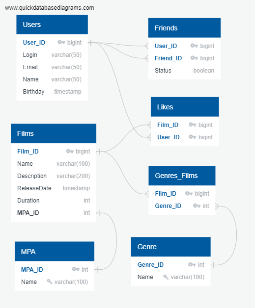

# java-filmorate
### ER-диаграмма базы данных

#### Таблица Users:  
- User_ID - уникальный идентификатор пользователя  
- Login - логин пользователя  
- Email - почтовый адрес пользователя  
- Name - имя пользователя  
- Birthday - дата рождения пользователя  

#### Таблица Friends:  
- User_ID - уникальный идентификатор пользователя  
- Friend_ID - уникальный идентификатор друга  
- Status - статус подтверждения дружбы  

#### Таблица Likes:  
- Film_ID - уникальный идентификатор фильма  
- User_ID - уникальный идентификатор пользователя  

#### Таблица Films:  
- Film_ID - уникальный идентификатор фильма    
- Name - наименование фильма  
- Description - описание фильма  
- ReleaseDate - дата релиза  
- Duration - продолжительность фильма в минутах   
- MPA_ID - уникальный идентификатор рейтинга фильма

#### Таблица Genres_Films:  
- Film_ID - уникальный идентификатор фильма  
- Genre_ID - уникальный идентификатор жанра  

#### Таблица Genre:  
- Genre_ID - уникальный идентификатор жанра  
- Name - наименование жанра

#### Таблица MPA:
- MPA_ID - уникальный идентификатор рейтинга фильма
- Name - наименование рейтинга

